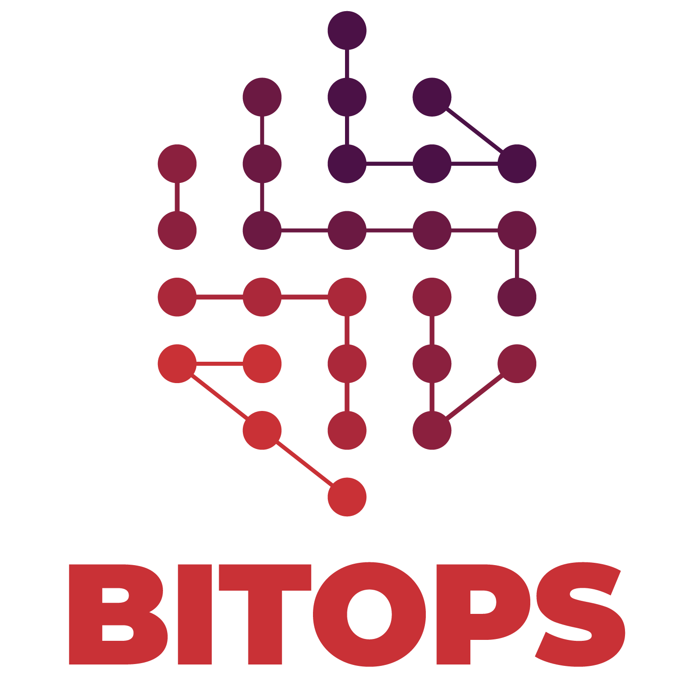

[<p align="center"></p>](docs/assets/images/logo/Bitops(RGB)_L2_Full_4C.png)

---------------------

[](LICENSE.md)
[](https://github.com/bitovi/bitops/releases)
[](https://www.bitovi.com/community/slack?utm_source=badge&utm_medium=badge&utm_campaign=pr-badge&utm_content=badge)

### tl;dr
BitOps is an automated [orchestrator](docs/about.md) for deployment tools using [GitOps](https://about.gitlab.com/topics/gitops/).

It leverages a way to describe infrastructure for many environments and IaC tools called an [Operations Repository](docs/operations-repo-structure.md).

---------------------

## Features

* **[Configurable](docs/configuration-base.md):** Configure how you want BitOps to deploy your application with yaml or environment variables.
* **[Event Hooks](docs/lifecycle.md):** If BitOps doesn't have built-in support for your usecase, execute arbitrary bash scripts at different points using BitOps' lifecycle.
* **[Pipeline Runner Agnostic](docs/examples.md):** By bundling all logic in BitOps, you can have the same experience regardless of which pipeline service runs your deployment pipeline. You can even run BitOps locally!
* **[Customizable](docs/plugins.md):** Configure what tools you want installed in your BitOps image. Only take what you need, leave the bloat behind. 

## How it works

BitOps is a deployment tool orchestrator packaged in a Docker image. An [Operations Repository](docs/operations-repo-structure.md) is mounted to a BitOps container's `/opt/bitops_deployment` directory, and BitOps will parse through a given environment directory and;

* Auto-detect BitOps configuration files within tool directories
* Loop through each tool and
  * Read in `yaml` configuration
  * Run any pre-execute hooks
  * Execute the tool
  * Run any post-execute hooks

## Quick Start
BitOps is packaged as a docker image and is available on [Dockerhub](https://hub.docker.com/r/bitovi/bitops).
```
docker pull bitovi/bitops:latest
cd $YOUR_OPERATIONS_REPO
docker run bitovi/bitops:latest -v .:/opt/bitops_deployment
```

Need an example? We got you! Check out our [Example Operation Repos](https://github.com/bitovi/operations-test)

## Configure BitOps
BitOps is configured in 3 steps:

1. Define [configuration](docs/configuration-base.md) for each tool in your environments
2. Configure access to your cloud provider
3. Configure how you want your deployment tools to execute

From there, the contents of the tool directories in your environments can exist exactly how the tool expects.

Ready to dive deeper? Check out our [Docs](docs/configuration-base.md)

Still not enough? Why not try building and running a [local version of BitOps](docs/development-local.md)

Need a hand with implementation? We can [help](https://www.bitovi.com/devops-consulting)

## Supported Plugins
* Provision infrastructure with [CloudFormation](https://github.com/bitops-plugins/cloudformation/blob/main/README.md)
* Provision infrastructure with [Terraform](https://github.com/bitops-plugins/terraform/blob/main/README.md)
* Configure infrastructure with [Ansible](https://github.com/bitops-plugins/ansible/blob/main/README.md)
* Deploy to kubernetes with [Helm](https://github.com/bitops-plugins/helm/blob/main/README.md)

> Don't see a plugin you want?  [Submit an issue](https://github.com/bitovi/bitops/issues) or [build your own](docs/plugins.md#creating-your-own-plugin)!

## Supported Cloud Providers
* [Amazon Web Services (AWS)](https://github.com/bitops-plugins/aws/blob/main/README.md)
* Microsoft Azure Cloud (Azure) - COMING SOON - https://github.com/bitovi/bitops/issues/13
* Google Cloud Engine (GCE) - COMING SOON - https://github.com/bitovi/bitops/issues/14

## Support / Contributing

We welcome any contributions from the community with open arms. Take a look at our [Contributing](docs/contributing/contributing.md) guide.

Come hangout with us on [Slack](https://www.bitovi.com/community/slack)!

### Updating Documentation

https://bitovi.github.io/bitops/ is auto-generated using [MKDocs](https://www.mkdocs.org/). Updating markdown in `docs/*` and ensuring the page is defined in `mkdocs.yml` will auto update the site when pushed to the `master` branch.

## Release History

See [Releases](https://github.com/bitovi/bitops/releases).

## License

[MIT License](/license).
