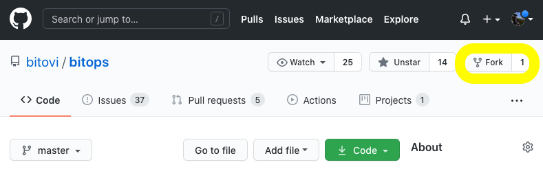

# Development Guide

We are excited for any contributions from the community, we welcome any feedback whether its:

* Submitting a bug report
* An idea for feature development
* Expanding functionality of an existing feature
* Submitting an example guide or blog using Bitops
* Security or other concerns

When contributing to BitOps, please consider some of the following basic guidelines before submitting.

## Requirements

To submit changes we require that all contributions first have a GitHub issue created where submissions can be discussed and visible to all Contributors and Maintainers.

By contributing, you agree to the [Developer Certificate of Origin (DCO)](DCO.md) which states that the code being submitted is owned wholly by you.

Contributors and Maintainers are expected to treat other community members with courtesy and respect, be willing and able to accept constructive criticism, and strive for understanding of other's viewpoints in all community channels.

## Building BitOps

Before continuing, if you haven't used GitHub before you may want to review GitHub's [forking guide](https://help.github.com/articles/fork-a-repo/) and [cloning guide](https://help.github.com/articles/cloning-a-repository/) which further explains how to clone a repo for any major operating system.

To develop BitOps, first fork BitOps to create a copy of the BitOps GitHub repo under your own account:



Then you need to clone your personal copy of the repository you just forked. Clicking the green `Code` button on your repo will give you a copiable URL to use:

```
git clone git@github.com:<your github username>/<repository-name>.git
cd bitops
git checkout -b your-branch-name
```

Replace `your-branch-name` with the name of the feature you're building, e.g. `git checkout -b some-ansible-feature` to create a `some-ansible-feature` branch.

As you're forking the code to work locally, you may not need or wish to create a separate branch, however BitOps will not allow commits directly to master and it's just a good habit to get into!

Then after modifying the code or adding your changes, re-build the BitOps docker image:

```
docker build bitops --tag bitovi/bitops:ansible-feature
```

You can now execute your modified version of BitOps locally to test your changes.

For example, to test your new `ansible-feature` version of BitOps with an Operations Repo environment named `ansible-operations-repo` containing an Ansible playbook and other data:

```
export AWS_ACCESS_KEY_ID=ABCDEF012345
export AWS_SECRET_ACCESS_KEY=ZYXWV09876
export AWS_DEFAULT_REGION=us-east-1
export MY_VAR1=value1
docker run \
-e BITOPS_ENVIRONMENT="ansible-operations-repo" \
-e AWS_ACCESS_KEY_ID=$AWS_ACCESS_KEY_ID \
-e AWS_SECRET_ACCESS_KEY=$AWS_SECRET_ACCESS_KEY \
-e AWS_DEFAULT_REGION=$AWS_DEFAULT_REGION \
-e MY_VAR1=$MY_VAR1 \
-v $(pwd):/opt/bitops_deployment \
bitovi/bitops:ansible-feature
```


## Understanding Bitops

BitOps has several packages and environment variables readily available which make working with BitOps easy:

### Standard Bitops Environmental Variables:

A `*` denotes a required variable.

| Variable          | Value                             |  Notes     |
|   :---            |   :---                            |    :---    |
| `$BITOPS_DIR`     | `/opt/bitops`                     |   Within the container the default working directory for BitOps        |
| `$BITOPS_ENVIRONMENT`*   | `YOUR_OPS_REPO_ENVIRONMENT`                   |   BitOps requires at least one environment folder to be specified at container execution.   |
| `$ENVROOT`        | `$TEMPDIR/$ENVIRONMENT`           |   e.g `/tmp/tmp.RANDOM/YOUR_OPS_REPO_ENVIRONMENT`  |
| `$TEMPDIR`        | `/tmp/tmp.RANDOM`                  |   This is the randomly generated working dir for BitOps.  |
| `$ROOT_DIR`        | `/opt/bitops_deployment`                  |   This working dir for BitOps (moved to `$TEMPDIR` during execution)  |

### Standard BitOps Packages and Libraries:

System Packages natively available in a running BitOps container:

* ansible
* aws / awscli
* binutils
* curl
* git
* glibc
* ig
* libsodium-dev
* unzip
* wget

> For the most up-to-date list, see
> [Dockerfile](https://github.com/bitovi/bitops/blob/main/Dockerfile)

Python packages natively available in BitOps:

* pip
* PyYAML
* setuptools
* shyaml
* wheel

> For the most up-to-date list, see [requirements.txt](https://github.com/bitovi/bitops/blob/main/requirements.txt)

### BitOps Code Structure:

The BitOps repo is fairly straight forward in its current implementation. Most aspects of BitOps are all handled as different `plugins`, including the setup and deployment of BitOps itself. This means that both BitOps container setup scripts such as `/bitops/scripts/deploy` as well as tool scripts like `/bitops/scripts/ansible` share a naming scheme and folder structure.

All scripts for a plugin should be contained within that plugin's named directory unless it requires an additional outside `deploy` script for configuration.


### Files of Note:

#### `bitops/scripts/setup/install_tools.sh`
This script downloads packages of required tools such as `aws-iam` to the BitOps container. If you are adding in a plugin that requries downloading a tools package to extract using `wget`, `install_tools.sh` will allow for that.

#### `bitops/scripts/deploy.sh`
This script orchestrates the order in which BitOps tools are deployed and configured. If you are adding a plugin that will require a specific ordering (e.g `before ansible but after terraform`), `deploy.sh` is where you can add in your plugin's entrypoint into the BitOps lifecycle.

#### `bitops/scripts/deploy/`
This directory contains scripts which common to all plugins.

#### `bitops/scripts/bitops-config/`
This directory contains base scripts that assist with parsing and converting the standard BitOps schema format. Check the included `README.md` within the bitops-config directory for examples.

### Creating a New Plugin

BitOps has additional [functionality being developed](https://github.com/bitovi/bitops/pull/55) to read any plugin folder for BitOps schema, even if it isn't one of the specified tools. BitOps will look for any BitOps schema within the plugin's directory as well as `before` and `after` deploy scripts for each. 

## Creating a PR

Once you have finished testing your code, please ensure you have first created an issue related to the feature you are developing.

After you've `git add`'d and `git commit`'d push your new branch to Github:

```
git push --set-upstream origin some-ansible-feature
```

Once your code has been submitted to Github, navigate to the _main BitOps Github_ page, and click the “New Pull Request” button. You'll want the original BitOps repo you forked _from_ not your personal/modified one.

Select `Compare across forks` and then select your branch name e.g `some-ansible-feature` as the 'compare' branch to attempt to merge. You may be warned about conflicts when merging the code, Github will try to tell you what is incorrect.

If you are having issues creating a Pull from your forked repo, GitHub has [a more thorough guide](https://docs.github.com/en/github/collaborating-with-issues-and-pull-requests/creating-a-pull-request-from-a-fork) than what is presented here.

If you're unable to solve the merge conflicts, don't worry you'll still be able to submit your PR, just make a note of the issues you were facing in the PR description and we will work with you to solve them.

Give your PR a meaningful title and provide details about the change in the description, including a link to the issue(s) relating to your PR. All that's left is to click the 'Create pull request' button and wait for our eager review of your code!

### Bash Styleguide

The BitOps container uses the Bourne shell during execution, please ensure all functions used in your submission exist for `sh`. Submissions that utilize alternate shells (`zsh`,`ksh`,`csh`, etc.) will not be accepted.

BitOps comes packaged with [`shyaml`](https://pypi.org/project/shyaml/) which can be used to parse YAML config files from stdout.

When contributing Bash code segments to BitOps please keep these concepts in mind:

* Add `echo` statements during plugin execution to give verbosity and debugging during execution
* Update any related documentation to the code or feature you are modifying
* Avoid multiple commands per line if possible. Replace `;` with whitespace and newline characters where appropriate.
* For scripts or other subroutines use `_` to connnect multiple word names, e.g `validate_env.sh`

### YAML Styleguide

BitOps uses standard YAML formatting with only a few reccomendations regarding style:

* When adding additional YAML files, utilize the full `.yaml` file extension
* For multi-word variable names use `-` hyphen to connect them, e.g `cfn-stack-name`
