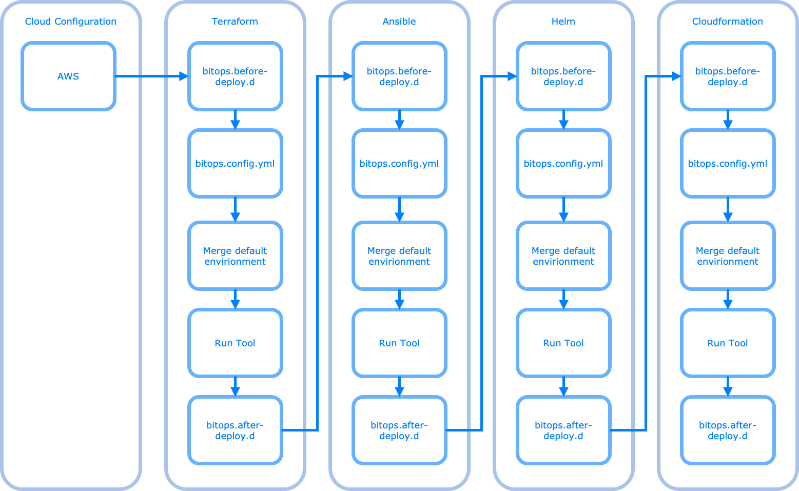

# Execution Lifecycle

## Lifecycle hooks
Within each tool directory, you can optionally have a `bitops.before-deploy.d/` and/or a `bitops.after-deploy.d/`. If any shell scripts exist within these directories, BitOps will execute them in alphanumeric order.

This is a useful way to extend the functionality of BitOps. A popular usecase we've seen is loading secrets or dynamically editing `bitops.config.yml`

## Detailed Execution Flow

A single run of BitOps will

1. Copy the contents of `/opt/bitops_deployment` to a temporary working directory
2. Attempt to setup a cloud provider
3. If a `terraform/` directory exists within the selected environment
    * Run any `bitops.before-deploy.d/*.sh` scripts 
    * Load `bitops.config.yml` and set environment
    * Merge contents with [Default environment](default-environment.md) - [TODO](https://github.com/bitovi/bitops/issues/18)
    * Select terraform version
    * Run `terraform init`
    * Select `terraform workspace`
    * Run `terraform plan`
    * Run `terraform apply` or `terraform destroy`
    * Run any `bitops.after-deploy.d/*.sh` scripts
4. If a `ansible/` directory exists within the selected environment
    * Run any `bitops.before-deploy.d/*.sh` scripts
    * Load `bitops.config.yml` and set environment
    * Merge contents with [Default environment](default-environment.md) - [TODO](https://github.com/bitovi/bitops/issues/18)
    * Run `ansible-playbook $playbook` for each `*.yaml` or `*.yml` file in `$env/ansible/` 
    * Run any `bitops.after-deploy.d/*.sh` scripts
4. If a `helm/` directory exists within the selected environment
    * Run the following for `$env/helm/$ENVIRONMENT_HELM_SUBDIRECTORY/` or for all charts in `$env/helm/`
        * Run any `bitops.before-deploy.d/*.sh` scripts
        * Load `bitops.config.yml` and set environment
        * Merge contents with [Default environment](default-environment.md)
        * Use `$KUBE_CONFIG_PATH` if defined, if not use aws cli to build .kubeconfig
        * Gather all values files - TODO document
        * Run `helm dep up`
        * Run `helm upgrade` or `helm install`
        * Run `helm rollback` on failure
        * Run any `bitops.after-deploy.d/*.sh` scripts
        * TODO `helm_install_external_charts` and `helm_install_charts_from_s3` never run!
4. If a `cloudformation/` directory exists within the selected environment
    * Run any `bitops.before-deploy.d/*.sh` scripts
    * Load `bitops.config.yml` and set environment
    * Merge contents with [Default environment](default-environment.md) - [TODO](https://github.com/bitovi/bitops/issues/18)
    * Run cfn template validation
    * Create or delete cfn stack. Wait for completion
    * Run any `bitops.after-deploy.d/*.sh` scripts

### Environment Variables
Plugins can export environment when a value is specified in a ops_repo level `bitops.config.yaml`. These environment variables are prefixed with `BITOPS` and their plugin name. 

So for example, if the terraform plugin exported the environment variable BUTTER_FLAG, it would be accessible in the lifecycle hooks by referencing; 

`BITOPS_TERRAFORM_BUTTER_FLAG`
